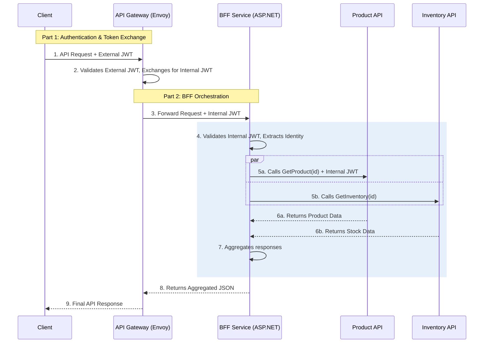

# Secure Microservices Playpen with a Backend for Frontend (BFF)

This project provides a complete, containerized playpen for demonstrating a secure microservices architecture using the **Token Exchange** and **Backend for Frontend (BFF)** patterns.

An external token from an Identity Provider (Keycloak) is securely exchanged at the API Gateway (Envoy) for a trusted internal token. This internal token is then propagated to a dedicated **BFF service** written in ASP.NET, which orchestrates calls to downstream microservices to compose a final, aggregated response.

### Architectural Flow


### Core Concepts Demonstrated
*   **Centralized Authentication:** Using Keycloak as an OpenID Connect (OIDC) Identity Provider.
*   **API Gateway:** Using Envoy for security (token exchange) and routing.
*   **Backend for Frontend (BFF) Pattern:** A dedicated ASP.NET service that acts as an orchestrator.
*   **API Composition:** The BFF composes a rich response by making parallel calls to downstream services.
*   **Identity Propagation:** The BFF securely propagates the user's identity to protected downstream services.
*   **Service Discovery & Load Balancing:** Services communicate via Docker service names, and Envoy load balances traffic.

### Technology Stack
*   **Orchestration:** Docker Compose
*   **Identity Provider (`IdP`):** Keycloak
*   **API Gateway (`APIG`):** Envoy Proxy
*   **Token Exchange Service:** ASP.NET Minimal API
*   **BFF Service:** ASP.NET Minimal API
*   **BFF Service (Go):** Go
*   **Upstream Microservices:** ASP.NET Minimal API (`product-api`, `inventory-api`)

### Final Directory Structure
```
token-exchange-playpen/
├── bff-api/
├── bff-api-go/
├── docker-compose.yml
├── envoy/
├── inventory-api/
├── product-api/
└── token-exchanger-dotnet/
```

## Step-by-Step Setup Instructions

### Step 1: Generate Signing Keys
The API Gateway needs a private/public key pair to sign and validate the internal JWTs.

1.  Navigate into the `envoy/keys` directory.
2.  Run the following `openssl` commands:
    ```bash
    # Generate a 2048-bit RSA private key
    openssl genpkey -algorithm RSA -out private_key.pem -pkeyopt rsa_keygen_bits:2048

    # Extract the public key from the private key
    openssl rsa -pubout -in private_key.pem -out public_key.pem
    ```

### Step 2: Create the Project Files
Create the directories and files for all services as developed in our conversation.

### Step 3: Build and Run the Stack
From the root directory, run:
```bash
docker compose up --build --detach
```
This will start a single instance of each service.

### Step 4: Configure Keycloak
After the stack starts, you need to configure Keycloak.

1.  **Access Keycloak:** Open your browser to `http://localhost:8080`. Log in with `admin` / `admin`.
2.  **Create a Realm:**
    *   Hover over "master" in the top-left and click **"Create Realm"**.
    *   **Realm name:** `myrealm`
    *   Click **Create**.
3.  **Create a Client:**
    *   Go to **Clients** and click **Create client**.
    *   **Client ID:** `my-web-app`
    *   Click **Next**.
    *   **Client authentication:** Keep it `On`.
    *   **Authentication flow:** Check the box for **Implicit flow**.
    *   Click **Next**.
    *   **Valid redirect URIs:** Enter `https://jwt.io` (This is a handy tool for decoding JWTs).
    *   Click **Save**.
4.  **Create a User:**
    *   Go to **Users** and click **Create new user**.
    *   **Username:** `testuser`
    *   Click **Create**.
    *   Go to the **Credentials** tab for the new user.
    *   Click **Set password**, enter a password (e.g., `password`), and turn **Temporary** `Off`. Click **Save**.

## Usage and Verification

### Part 1: Get the External Token
1.  **Open an Incognito Window** in your browser to ensure a clean session.
2.  Navigate to the following URL. This simulates a client application redirecting a user to log in.
    ```
    http://localhost:8080/realms/myrealm/protocol/openid-connect/auth?client_id=my-web-app&response_type=token&scope=openid&redirect_uri=https://jwt.io
    ```
3.  Log in as `testuser` with the password you set.
4.  You will be redirected to `jwt.io`. Copy the long **Encoded** token string.

### Part 2: Test the Aggregated Endpoint

1.  Store your token in an environment variable:
    ```bash
    export EXTERNAL_TOKEN="PASTE_YOUR_TOKEN_HERE"
    ```

2.  Call the protected endpoint through the Envoy gateway. Envoy will route this to the BFF.
    ```bash
    curl -H "Authorization: Bearer $EXTERNAL_TOKEN" http://localhost:9090/api/products/1
    ```

3.  **Check the Output:** You should see a successful, aggregated JSON response:
    ```json
    {"id":1,"name":"Photon Laptop","description":"High-performance laptop for developers.","price":1200,"stockCount":50}
    ```
    This proves the entire flow, including the BFF's orchestration, was successful.

4.  **Verify the Flow:** Check the logs of the services to see the chain of calls.
    ```bash
    docker compose logs bff-api
    docker compose logs product-api
    docker compose logs inventory-api
    ```
    You will see a log from the `bff-api` first, followed by logs from both downstream services, proving the orchestration worked.

### Part 3: Test the Go BFF Endpoint
To demonstrate the polyglot nature of the architecture, you can call the same endpoint on the Go BFF.

1.  Call the protected endpoint through the Envoy gateway, this time using the `/api-go` route.
    ```bash
    curl -H "Authorization: Bearer $EXTERNAL_TOKEN" http://localhost:9090/api-go/products/1
    ```

2.  **Check the Output:** You should see the exact same successful, aggregated JSON response as the .NET BFF.

3.  **Verify the Flow:** Check the logs of the Go BFF to see the chain of calls.
    ```bash
    docker compose logs bff-api-go
    ```

### Part 4: Test Scalability and Load Balancing
Now, let's scale our `product-api` to see how the system handles load.

1.  **Stop and restart the stack with scaling enabled.** Use the `--scale` flag to start 3 replicas of the `product-api`.
    ```bash
    docker compose up --build --detach --scale product-api=3
    ```

2.  **Call the API multiple times** to generate traffic.
    ```bash
    curl -H "Authorization: Bearer $EXTERNAL_TOKEN" http://localhost:9090/api/products/2
    curl -H "Authorization: Bearer $EXTERNAL_TOKEN" http://localhost:9090/api/products/3
    curl -H "Authorization: Bearer $EXTERNAL_TOKEN" http://localhost:9090/api/products/1
    ```

3.  **Check the aggregated logs** to see which container handled each request.
    ```bash
    docker compose logs product-api
    ```
    You will see output from different container hostnames, proving that Envoy is distributing the load.
    ```
    product-api-1  | ---> Request handled by container 'a1b2c3d4e5f6' for user: 'testuser'
    product-api-3  | ---> Request handled by container 'c3d4e5f6a1b2' for user: 'testuser'
    product-api-2  | ---> Request handled by container 'b2c3d4e5f6a1' for user: 'testuser'
    ```

## Architectural Deep Dive

### The Role of the BFF (Backend for Frontend)

In this architecture, we use a dedicated **BFF service** to handle complex orchestration. This is a common and robust pattern with several advantages:

*   **Keeps the Gateway Simple:** The API Gateway (Envoy) focuses on cross-cutting concerns like security, routing, and rate-limiting. It does not contain complex business logic.
*   **Developer Experience:** The complex aggregation logic is written in C#, a full-featured language with excellent tooling for debugging and testing. This is far more maintainable than embedding complex logic in Envoy's configuration or scripts.
*   **API Composition:** The BFF aggregates data by calling the public APIs of other services, not by accessing their databases directly. This respects microservice boundaries and ensures that each service remains the single source of truth for its data.

### Polyglot Services (Go and .NET)
This project includes two BFF implementations—one in ASP.NET and one in Go—to demonstrate the language-agnostic nature of a well-designed microservices architecture. As long as each service adheres to the public contract (in this case, HTTP APIs and JWTs), the underlying implementation language doesn't matter. This allows teams to choose the best tool for the job for each service.

### How Envoy Achieves Load Balancing

This works seamlessly thanks to the combination of Docker's networking and a specific Envoy setting.

**1. Docker's Role: Service Discovery via DNS**

When you create a Docker network, it includes a built-in DNS server. This DNS server maps the **service name** from your `docker-compose.yml` (e.g., `product-api`) to the IP addresses of all containers running for that service. When Envoy asks for the IP for `product-api`, the DNS server returns a list containing the IPs of all three running replicas.

**2. Envoy's Role: The `LOGICAL_DNS` Cluster Type**

The `envoy.yaml` configuration is specifically designed to handle this behavior.

```yaml
# In envoy.yaml
clusters:
  - name: product_api_cluster
    type: LOGICAL_DNS  # <-- This is the crucial setting
    load_assignment:
      cluster_name: product_api_cluster
      endpoints:
      - lb_endpoints:
        - endpoint:
            address:
              socket_address:
                # This uses the Docker SERVICE name, not a container name
                address: product-api
                port_value: 8080
```

The `type: LOGICAL_DNS` tells Envoy:
> "When you resolve the address `product-api`, expect the DNS server to return *multiple* IP addresses. Treat every IP in that list as a member of this load balancing pool."

By default, Envoy will then distribute incoming requests across all healthy members of this pool using a **round-robin** strategy, achieving both scalability and resilience.

## Next Steps

With this robust foundation, you can now explore:
*   **Health Checks:** Add `/health` endpoints to each service and configure Envoy to use them, making your system more resilient.
*   **Distributed Tracing:** Integrate a tool like OpenTelemetry to get a visual trace of a request as it flows from Envoy to the BFF and across all the downstream microservices.
*   **Implement a Real Client:** Build a simple frontend application that performs the full OIDC login flow and calls your API.
