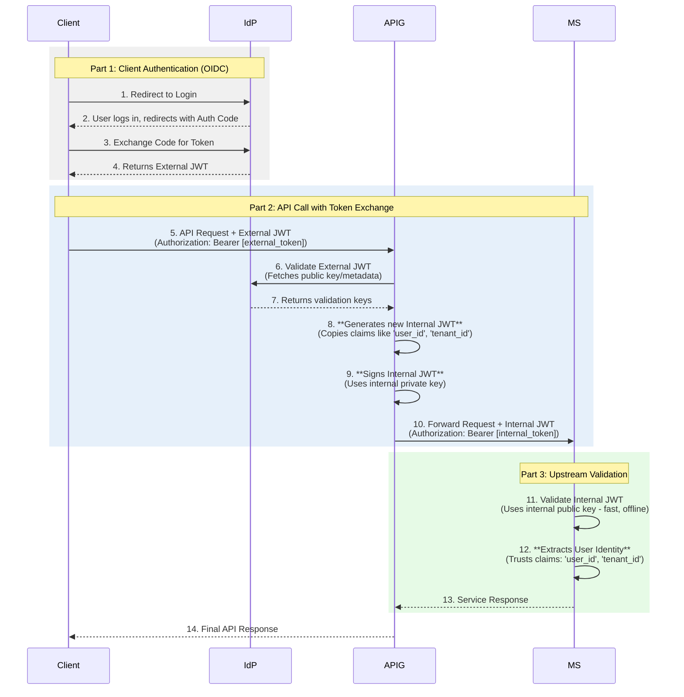

# Secure Microservices Playpen with Token Exchange

This project provides a complete, containerized playpen for demonstrating a secure microservices architecture using the **Token Exchange** pattern. An external token from an Identity Provider (Keycloak) is securely exchanged at the API Gateway (Envoy) for a trusted internal token, which is then used for communication between backend services (ASP.NET).

This setup is designed to be a realistic foundation for exploring advanced patterns like service discovery, load balancing, and response aggregation.

### Architectural Flow


### Core Concepts Demonstrated
*   **Centralized Authentication:** Using Keycloak as an OpenID Connect (OIDC) Identity Provider.
*   **API Gateway:** Using Envoy as a secure entry point to the system.
*   **Token Exchange Pattern:** Exchanging an external JWT for a trusted, internally-signed JWT at the gateway.
*   **Backend Security:** An ASP.NET service validating the internal JWT using a public key.
*   **Identity Propagation:** Extracting user claims (`sub`, `preferred_username`) from the token to be used in the service's business logic.
*   **Service Discovery:** Services communicating via their Docker service names (e.g., `product-api`).
*   **Scalability & Load Balancing:** Running multiple instances of a backend service with Envoy automatically distributing traffic.

### Technology Stack
*   **Orchestration:** Docker Compose
*   **Identity Provider (`IdP`):** Keycloak
*   **API Gateway (`APIG`):** Envoy Proxy
*   **Token Exchange Service:** ASP.NET Minimal API
*   **Upstream Microservice:** ASP.NET Minimal API

### Prerequisites
*   Docker and Docker Compose
*   .NET 8 SDK (to create the projects)
*   OpenSSL (for generating keys)

### Final Directory Structure
```
token-exchange-playpen/
├── docker-compose.yml
├── envoy/
│   ├── envoy.yaml
│   └── keys/
│       ├── private_key.pem
│       └── public_key.pem
├── product-api/
│   ├── Dockerfile
│   └── ProductApi/
│       ├── Program.cs
│       └── ...
└── token-exchanger-dotnet/
    ├── Dockerfile
    └── TokenExchanger/
        ├── Program.cs
        └── ...
```

## Step-by-Step Setup Instructions

### Step 1: Generate Signing Keys

The API Gateway needs a private/public key pair to sign and validate the internal JWTs.

1.  Navigate into the `envoy/keys` directory.
2.  Run the following `openssl` commands:

    ```bash
    # Generate a 2048-bit RSA private key
    openssl genpkey -algorithm RSA -out private_key.pem -pkeyopt rsa_keygen_bits:2048

    # Extract the public key from the private key
    openssl rsa -pubout -in private_key.pem -out public_key.pem
    ```

### Step 2: Create the Project Files

Create the directories and files as shown in the structure above, populating them with the source code developed throughout our conversation.

### Step 3: Build and Run the Stack

This command will build the Docker images for our ASP.NET services, pull the images for Keycloak and Envoy, and start all containers.

From the root `token-exchange-playpen` directory, run:
```bash
docker compose up --build --detach
```
This will start a single instance of each service. We will scale the `product-api` later to test load balancing.

### Step 4: Configure Keycloak

After the stack starts, you need to configure Keycloak.

1.  **Access Keycloak:** Open your browser to `http://localhost:8080`. Log in with `admin` / `admin`.

2.  **Create a Realm:**
    *   Hover over "master" in the top-left and click **"Create Realm"**.
    *   **Realm name:** `myrealm`
    *   Click **Create**.

3.  **Create a Client:**
    *   Go to **Clients** and click **Create client**.
    *   **Client ID:** `my-web-app`
    *   Click **Next**.
    *   **Client authentication:** Keep it `On`.
    *   **Authentication flow:** Check the box for **Implicit flow**.
    *   Click **Next**.
    *   **Valid redirect URIs:** Enter `https://jwt.io` (This is a handy tool for decoding JWTs).
    *   Click **Save**.

4.  **Create a User:**
    *   Go to **Users** and click **Create new user**.
    *   **Username:** `testuser`
    *   Click **Create**.
    *   Go to the **Credentials** tab for the new user.
    *   Click **Set password**, enter a password (e.g., `password`), and turn **Temporary** `Off`. Click **Save**.

5.  **(Troubleshooting) Set Proxy Mode:** If you get an "HTTPS Required" error, it's because modern Keycloak versions have stricter security. Fix this by adding the following environment variable to the `keycloak` service in your `docker-compose.yml` and restarting:
    ```yaml
    environment:
      # ... other variables
      - KC_PROXY=edge
    ```

## Usage and Verification

Follow these steps to test the entire system, from authentication to load balancing.

### Part 1: Get the External Token

1.  **Open an Incognito Window** in your browser to ensure a clean session.
2.  Navigate to the following URL. This simulates a client application redirecting a user to log in.
    ```
    http://localhost:8080/realms/myrealm/protocol/openid-connect/auth?client_id=my-web-app&response_type=token&scope=openid&redirect_uri=https://jwt.io
    ```
3.  Log in as `testuser` with the password you set.
4.  You will be redirected to `jwt.io`. Copy the long **Encoded** token string.

### Part 2: Test the Core Token Exchange

1.  **Open your terminal** and store the token in an environment variable.
    ```bash
    export EXTERNAL_TOKEN="PASTE_YOUR_TOKEN_FROM_JWT.IO_HERE"
    ```

2.  **Call the protected `product-api` endpoint** through the Envoy gateway.
    ```bash
    curl -H "Authorization: Bearer $EXTERNAL_TOKEN" http://localhost:9090/api/products/1
    ```

3.  **Check the Output:** You should see a successful JSON response with the product details:
    ```json
    {"id":1,"name":"Photon Laptop","description":"High-performance laptop for developers.","price":1200}
    ```
    This proves the entire token exchange and validation flow was successful.

### Part 3: Test Scalability and Load Balancing

Now, let's scale our `product-api` to see how the system handles load.

1.  **Stop and restart the stack with scaling enabled.** Use the `--scale` flag to start 3 replicas of the `product-api`.
    ```bash
    docker compose up --build --detach --scale product-api=3
    ```

2.  **Call the API multiple times** to generate traffic.
    ```bash
    curl -H "Authorization: Bearer $EXTERNAL_TOKEN" http://localhost:9090/api/products/2
    curl -H "Authorization: Bearer $EXTERNAL_TOKEN" http://localhost:9090/api/products/3
    curl -H "Authorization: Bearer $EXTERNAL_TOKEN" http://localhost:9090/api/products/1
    ```

3.  **Check the aggregated logs** to see which container handled each request.
    ```bash
    docker compose logs product-api
    ```
    You will see output from different container hostnames, proving that Envoy is distributing the load.
    ```
    product-api-1  | ---> Request handled by container 'a1b2c3d4e5f6' for user: 'testuser'
    product-api-3  | ---> Request handled by container 'c3d4e5f6a1b2' for user: 'testuser'
    product-api-2  | ---> Request handled by container 'b2c3d4e5f6a1' for user: 'testuser'
    ```

## Architectural Deep Dive: How Load Balancing Works

A primary advantage of a microservice architecture is the ability to scale individual services independently. Here's how Envoy and Docker work together to make this seamless.

### The Startup Command Explained

```bash
docker compose up --build --detach --scale product-api=3
```
*   `docker compose up`: The standard command to create and start all services.
*   `--build`: Builds the images for our custom services from their Dockerfiles.
*   `--detach`: Runs the containers in the background.
*   `--scale product-api=3`: Instructs Docker Compose to specifically start **3 instances** of the `product-api` service.

### How Envoy Achieves Load Balancing

This works seamlessly thanks to the combination of Docker's networking and a specific Envoy setting.

**1. Docker's Role: Service Discovery via DNS**

When you create a Docker network, it includes a built-in DNS server. This DNS server maps the **service name** from your `docker-compose.yml` (e.g., `product-api`) to the IP addresses of all containers running for that service. When Envoy asks for the IP for `product-api`, the DNS server returns a list containing the IPs of all three running replicas.

**2. Envoy's Role: The `LOGICAL_DNS` Cluster Type**

The `envoy.yaml` configuration is specifically designed to handle this behavior.

```yaml
# In envoy.yaml
clusters:
  - name: product_api_cluster
    type: LOGICAL_DNS  # <-- This is the crucial setting
    load_assignment:
      cluster_name: product_api_cluster
      endpoints:
      - lb_endpoints:
        - endpoint:
            address:
              socket_address:
                # This uses the Docker SERVICE name, not a container name
                address: product-api
                port_value: 8080
```

The `type: LOGICAL_DNS` tells Envoy:
> "When you resolve the address `product-api`, expect the DNS server to return *multiple* IP addresses. Treat every IP in that list as a member of this load balancing pool."

By default, Envoy will then distribute incoming requests across all healthy members of this pool using a **round-robin** strategy, achieving both scalability and resilience.

## Next Steps

With this foundation, you can now:
*   **Add an Inventory Service:** Create a second microservice (`inventory-api`) that is only accessible internally. Modify the `product-api` to call this new service to fetch stock levels and aggregate the data.
*   **Explore Advanced Envoy Patterns:** Move the response aggregation logic from the `product-api` up into the Envoy gateway itself using the Lua filter.
*   **Implement a Real Client:** Build a simple frontend application (e.g., in React or Blazor) that performs the OIDC login flow against Keycloak and calls your API.