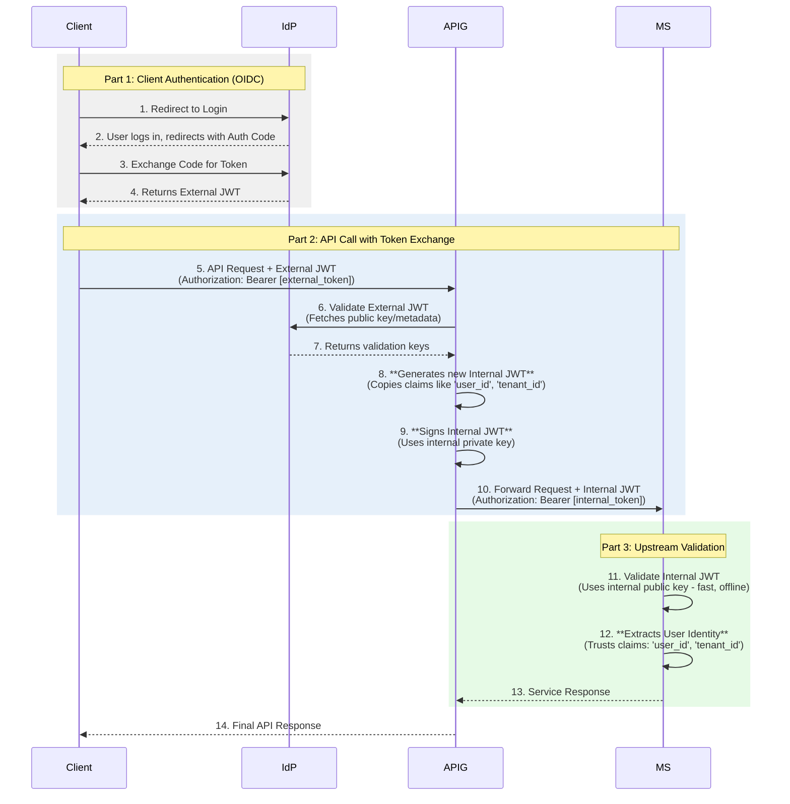

# Token exchange in APIG playpen

```mermaid
sequenceDiagram
    participant Client
    participant IdP
    participant APIG
    participant MS

    rect rgb(240, 240, 240)
        note over Client, IdP: Part 1: Client Authentication (OIDC)
        Client->>IdP: 1. Redirect to Login
        IdP-->>Client: 2. User logs in, redirects with Auth Code
        Client->>IdP: 3. Exchange Code for Token
        IdP-->>Client: 4. Returns External JWT
    end

    rect rgb(230, 240, 250)
        note over Client, MS: Part 2: API Call with Token Exchange
        Client->>APIG: 5. API Request + External JWT<br>(Authorization: Bearer [external_token])
        
        APIG->>IdP: 6. Validate External JWT<br>(Fetches public key/metadata)
        IdP-->>APIG: 7. Returns validation keys
        
        APIG->>APIG: 8. **Generates new Internal JWT**<br>(Copies claims like 'user_id', 'tenant_id')
        APIG->>APIG: 9. **Signs Internal JWT**<br>(Uses internal private key)
        
        APIG->>MS: 10. Forward Request + Internal JWT<br>(Authorization: Bearer [internal_token])
    end

    rect rgb(230, 250, 230)
        note over MS: Part 3: Upstream Validation
        MS->>MS: 11. Validate Internal JWT<br>(Uses internal public key - fast, offline)
        MS->>MS: 12. **Extracts User Identity**<br>(Trusts claims: 'user_id', 'tenant_id')
        MS-->>APIG: 13. Service Response
    end
    
    APIG-->>Client: 14. Final API Response
```